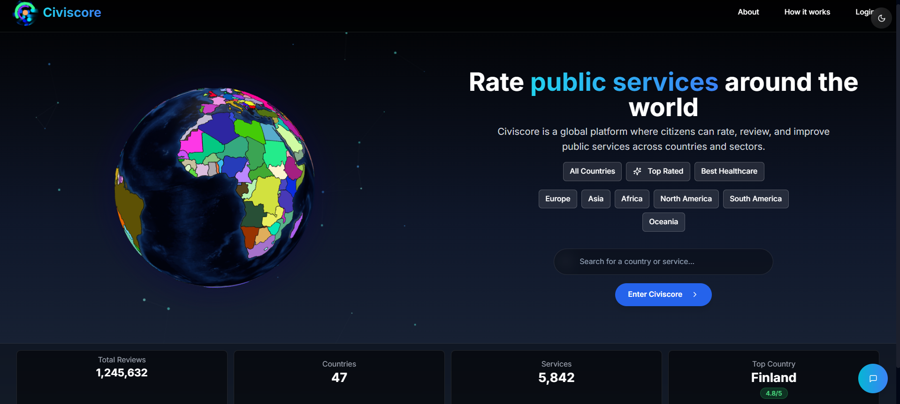
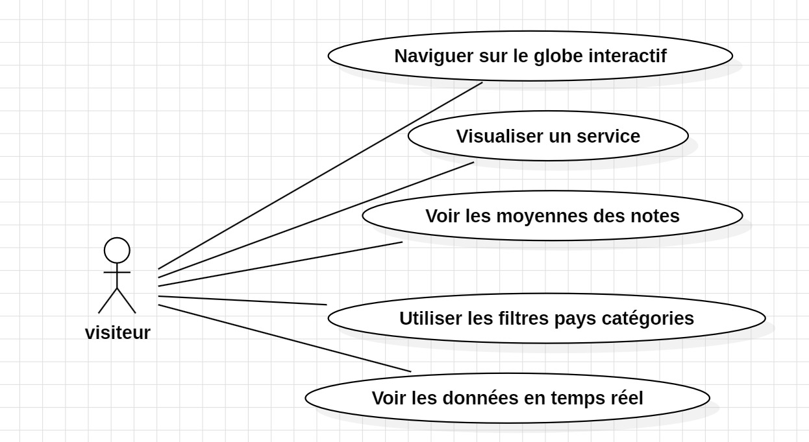
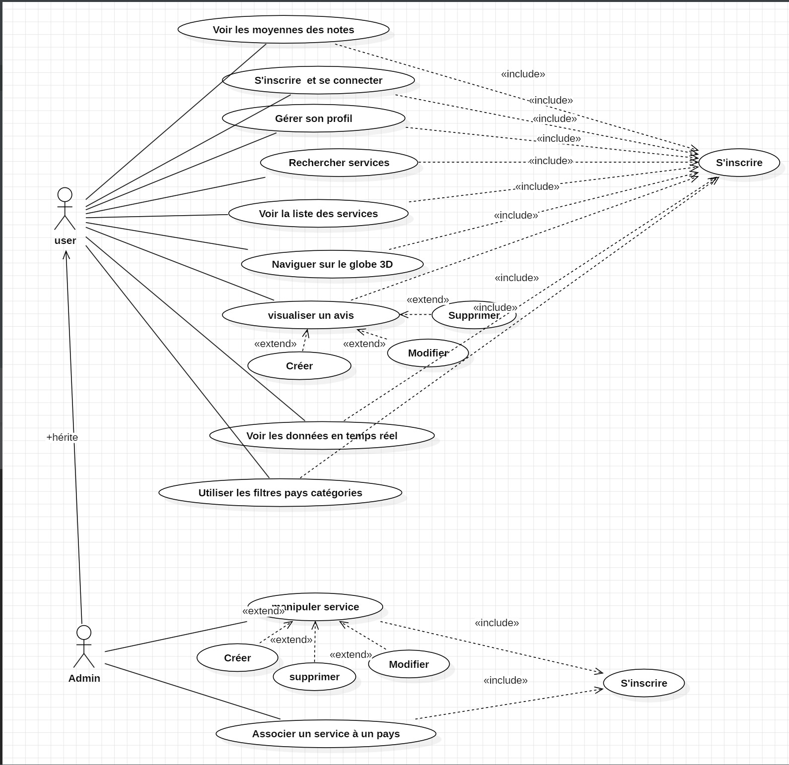
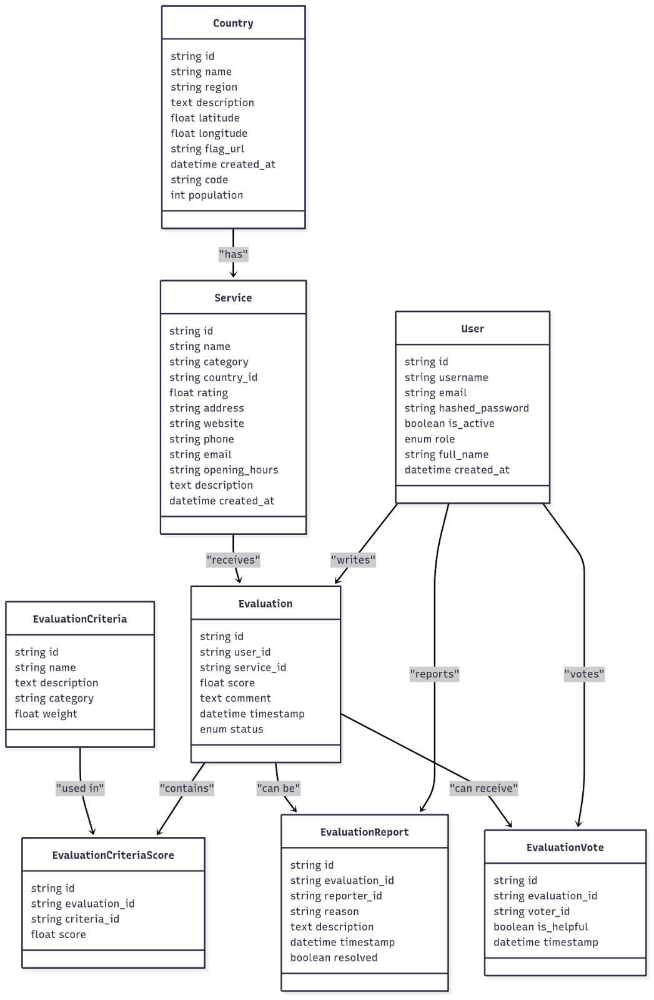

# 🌍 Civiscore

*Plateforme participative d’évaluation des services publics par les citoyens.*

Civiscore offre une vision transparente et interactive de la qualité des services publics dans différents pays.  
Technologies utilisées : **FastAPI**, **MySQL**, **React.js**, **Axios**, **TailwindCSS**, **globe.gl**.

<p align="center">
  
</p>

---

## 📚 Sommaire

- [🚀 Fonctionnalités principales](#-fonctionnalités-principales)
- [📦 Tech Stack & choix techniques](#-tech-stack--choix-techniques)
- [🗂 Structure du projet](#-structure-du-projet)
- [⚙ Installation & exécution locale](#-installation--exécution-locale)
- [🧰 Utilisation de l’API](#-utilisation-de-lapi)
- [🧩 Diagrammes UML](#-diagrammes-uml)
- [🧪 Tests & qualité](#-tests--qualité)
- [🔧 CI/CD & déploiement](#-cicd--déploiement)
- [🧭 Perspectives](#-perspectives)
- [📄 Licence & contribution](#-licence--contribution)
- [🤝 Auteurs](#-auteurs)

---

## 🚀 Fonctionnalités principales

- 🔐 *Authentification sécurisée* : inscription, connexion, gestion des rôles avec JWT.
- 📝 *CRUD complet* : gestion des services, avis, utilisateurs.
- 🗺 *Globe 3D interactif* : visualisation dynamique des services par pays via globe.gl.
- 📊 *Statistiques en temps réel* : notes moyennes, votes, heatmaps.
- ⚡ *Interface moderne et responsive* : React.js + TailwindCSS, animations Framer Motion.

---

## 📦 Tech Stack & choix techniques

| 🧪 Technologie | ✅ Pourquoi ? |
|---|---|
| *FastAPI* | Rapidité, validation automatique, support async, sécurité intégrée (JWT), documentation Swagger. |
| *MySQL* | Base relationnelle fiable, adaptée aux données structurées, évolutive et robuste. |
| *SQLAlchemy* | ORM flexible, abstraction de la BDD, facile à maintenir. |
| *React.js* | UI réactive, composants modulaires, large écosystème, performance front-end. |
| *Axios* | Client HTTP simple et efficace pour consommer l’API REST. |
| *TailwindCSS* | Style utilitaire pour développement rapide, responsive et cohérent. |
| *globe.gl* | Visualisation 3D interactive et performante des données géolocalisées. |
| *Docker* | Conteneurisation isolée pour déploiement et développement reproductible. |
| *GitHub Actions* | CI/CD automatisé : tests, lint, build, déploiement continu. |

---

## 🗂 Structure du projet
```
/
├── backend/                # API FastAPI + logique métier
├── app/                   # React.js + TailwindCSS + globe.gl
├── docker-compose.yml     # Orchestration backend, frontend, BDD
├── Dockerfile.backend     
├── Dockerfile.app         
└── .github/workflows/ci-cd.yml  # Pipeline CI/CD
```

---

## ⚙ Installation & exécution locale

1. 🔄 Cloner le dépôt :
```bash
git clone https://github.com/Fadi-AICH/Civiscore.git
cd civiscore
```

2. ⚙️ Configurer les variables d’environnement :
```bash
cp .env.example .env
```

3. 🐳 Démarrer les services avec Docker Compose :
```bash
docker-compose up --build
```

> - Backend API : `http://localhost:8000`  
> - Frontend React : `http://localhost:3000`

4. 🧪 Lancer les tests :
- Backend : `pytest backend/`
- Frontend : `npm test` (dans le dossier `app/`)

---

## 🧰 Utilisation de l’API

Consultez la documentation interactive (Swagger UI) ici :  
📎 [`http://localhost:8000/docs`](http://localhost:8000/docs)

---

### *API Endpoints List*

#### 🔐 Authentification
- `POST /api/v1/auth/signup`
- `POST /api/v1/auth/login`

#### 🧾 Services
- CRUD : `/api/v1/services/`, `/api/v1/services/{id}`
- Importation & enrichissement : `/api/v1/services/import-from-places`, `/enrich`

#### ⭐ Evaluations
- CRUD : `/api/v1/evaluations/`
- Stats : `/stats/service/{id}`, `/stats/overall`
- Votes : `/evaluation-votes/`

#### 👥 Utilisateurs
- `/api/v1/users/`
- `/api/v1/users/{user_id}`

#### 📝 Critères
- `/api/v1/evaluation-criteria/`
- `/scores/{evaluation_id}`

_(La liste complète est maintenue dans la documentation Swagger)_

---

### [🧩 Diagrammes UML](#-diagrammes-uml)

Représente les entités principales de l'application (User, Service, Evaluation...) et leurs relations.

<p align="center">
  
</p>

---

### 👤 Diagramme de cas d’utilisation – Utilisateur / Admin

Montre comment un utilisateur interagit avec le système (recherche, avis, consultation, etc.) et ce que peut faire un administrateur.

<p align="center">
  
</p>

---

### 🧍‍♂️ Diagramme de cas d’utilisation – Visiteur

Ce diagramme illustre les actions disponibles pour un visiteur non inscrit.

<p align="center">
  
</p>

---

## 🧪 Tests & qualité

- ✅ Backend : `pytest` + validation Pydantic, sécurité endpoints
- ✅ Frontend : tests de composants + interaction
- ✅ Intégration : simulations utilisateur (inscription, avis, vote)
- 📊 Couverture de tests > 80 %

---

## 🔧 CI/CD & déploiement

- ⚙️ **Pipeline GitHub Actions** (`ci-cd.yml`) :
  1. Lint Python/JS
  2. Tests backend et frontend
  3. Build Docker images
  4. Déploiement continu

- 🚀 **Lien de Déploiement** :
  [https://civiscore.vercel.app/](https://civiscore.vercel.app/)

---

## 🧭 Perspectives

- 🔔 Notifications temps réel (WebSocket)
- 🗣 Multi‑langue (i18n)
- 📤 Export CSV / PDF
- 🧱 Migration microservices (review-service…)

---

## 📄 Licence & contribution

- Licence : MIT
- Contributions ouvertes via Pull Request
- Bugs, idées ? Ouvrez une issue 🙌

---

## 🤝 Auteurs

👤 **Fadi AICH**  
👤 **ELHAMDOUCHI Ilyasse**  
👤 **EL BADRE Anas**

---

> Merci d’avoir consulté Civiscore !  
> ⭐ N’oubliez pas d’étoiler le dépôt si vous trouvez le projet utile.
